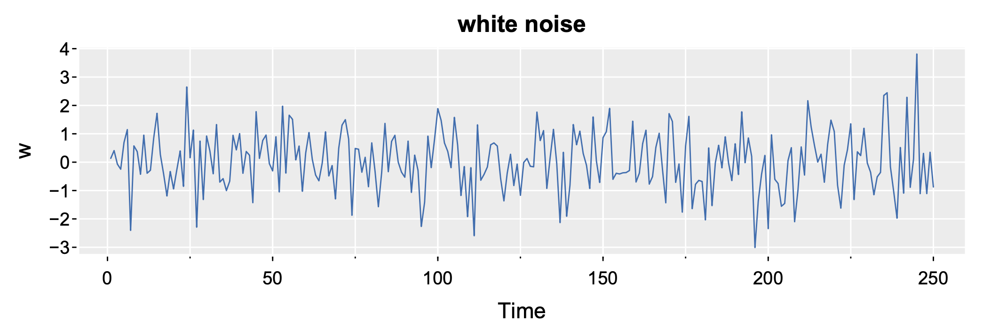
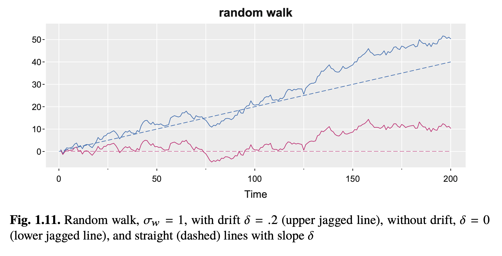
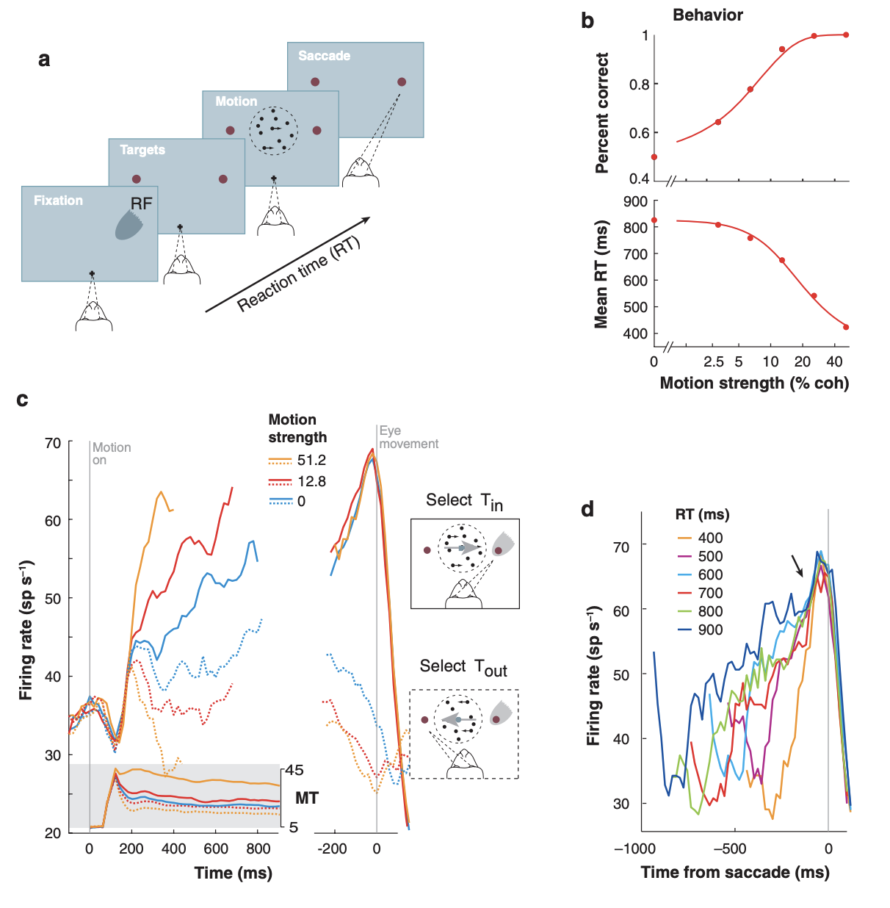

* **Reading**: Chapter 1.2 – Shumway and Stoffer

# Review / basic concepts

* Most time series are not iid
* Instead, most have dependence on time
	* Sometimes called "autocorrelation" - the $x_t$ is correlated with $x_{t-1}, ..., x_{t-p}$
* Some have _drift_
* The purpose of time series analysis is to develop mathematical models to provide plausible explanations for sample data

# Stochastic process

* Systems or phenomena that evolve randomly over time
* Many time series are modeled as realizations of stochastic processes, even though they contain components that are deterministic / predictable. 
* These are addressed in more detail in Stat150!

# White noise

Many real-world time series are a combination of underlying signal $s_t$ plus noise $w_t$. In some (nice) cases, $w_t$ is _white noise_.

White noise is a special case of uncorrelated variables in sequence, e.g. $x_t$ where $t=1,2,3,...$. White noise, unlike most real time series, *is* iid, with mean $0$ and variance $\sigma^2_w$.  One very useful case is white noise from a Gaussian distribution, where we can write: $w_t \sim \mbox{iid } \mathcal{N}(0,\sigma^2_w)$.

If all time series could be described in this way, classical statistics would suffice. 

What does white noise look like?

# Moving average

One way of smoothing a time series (including white noise) is to average the value at a time point $t$ with its neighbors $t-1$ and $t+1$ (or an even larger window from $t-p$ to $t+p$). For example:

$v_t = \frac{1}{3}(w_{t-1}+w_t+w_{t+1})$ 

or more generally

$v_t = \frac{1}{n} \displaystyle\sum_{k=-\frac{n-1}{2}}^{\frac{n-1}{2}} w_{t+k}$ for odd $n$

This is inherently a low-pass filter (lets low frequency signals pass, gets rid of high frequency). It preserves trends slower than $\sim n$ samples, and suppresses oscillations with period $\lesssim n$ samples.

**When do we use this?**

We might use this to reveal trends in noisy time series data, remove fluctuations we consider "noise", or do simple online smoothing (especially if we choose the window to include only data in the past). However, this is the most basic form of smoothing and is typically replaced by more complex methods such as exponential moving averages, Kalman filters, median filter, etc.

# Autoregression

Another flavor of dataset we might see is data that comes from an autoregressive process. Autoregression = regression or prediction based on past values of the same time series ("auto").

This might look something like:

$x_t = 1.5 x_{t-1} - 0.75 x_{t-2} + w_t$

You will see what this looks like in Lab 1. Because the data at $t$ relies on $t-1$ and $t-2$ (the prior two data points), this is an AR(2) process. Generating data in this way can result in oscillatory behavior.

# Random Walk

Another simple but important / helpful extension to the idea of white noise is the random walk. The simple random walk is defined as:

$x_t = x_{t-1} + w_t$ with initial condition $x_0 = 0$. 

Equivalently, $x_t = \displaystyle\sum_{j=1}^t w_j$

The expected value of any time point $\mathbb{E}[x_t] = \mathbb{E}[x_0] = 0$, so the mean does not vary over time.

The variance of a random walk, on the other hand, is additive and grows linearly with time:

$\operatorname{Var}(x_t) = \operatorname{Var}(\displaystyle\sum_{j=1}^t w_j) = t \sigma^2$

Are random walks iid? No! Each time point is not independent, but depends on the past time point. They're also not identically distributed, since variance is changing with time.

**What are some real examples?**

* Stock prices (over short time scales - days, not months/years)
* Brownian motion (continous time) - diffusion of molecules
* Null models for decision making (no evidence accumulation)

## Random Walk with Drift

More frequently, we see the concept of the random walk with drift ($\delta$). This extends the idea of the random walk.

$x_t = \delta + x_{t-1} + w_t$ with initial condition $x_0 = 0$.

Equivalently, $x_t = \delta t + \displaystyle\sum_{j=1}^t w_j$

Here, the expected value is related directly to the drift term: $\mathbb{E}[x_t] = \delta t + x_0$. However, if we know the drift and we can condition on a prior observations ($x_s$, we can get a conditional expectation: $\mathbb{E}[x_t | x_s] = x_s + \delta (t-s)$

Again, the variance scales with the number of time points as noise is accumulating step by step.

**What are some real examples?**

* Stock prices over longer time scales 
* Decision making (drift diffusion models)
* Atmospheric concentrations of CO2 (drift represents human influences, stochastic noise reflects natural variability)

## Drift diffusion models

Drift diffusion models are a cognitive model explaining how people accumulate evidence to make decisions. In these models, $x_t$ is a decision variable, and the drift $\delta$ represents the mean evidence gained per unit time. Usually we also set boundaries for a binary choice: $-1$ for an incorrect choice or $1$ for a correct choice. We can then calculate the reaction time for the decision, which is the first time at which $x_t$ hits either of the choice values, at which point the random walk stops. For no drift, we expect a long reaction time and a 50/50 probability of the correct or incorrect choice. High confidence / high information can be represented by a high value of $\delta$. For example, your $\delta$ values may be lower if you are doing a visual discrimination task under a lot of noise (uncertainty). $\delta$ values could also be increased by motivation or by higher certainty information.

An example of neurons performing something that looks like evidence accumulation is shown from [Gold \& Shadlen (2007)](https://pubmed.ncbi.nlm.nih.gov/17600525/). This is from a decision making task in which a monkey watches movies of moving dots, where a certain percentage of the dots move coherently, making the task either very easy (all the dots moving the same way) or not (very few coherent dots). 

# Signal in noise

More generally, we can see other examples of periodic signals contaminated by white noise. For example:

$x_t = A*\cos(2\pi\omega t+\phi) + w_t$

Where $A$ is the amplitude of the signal, $\omega$ is the frequency of the oscillation, and $\phi$ is a phase shift.

The ratio of the amplitude of the signal to the standard deviation of the noise determines the SNR - signal to noise ratio. The larger the SNR, the easier it is to recover our signal.

Later, we will use various forms of regression to try to recover these signals!

# Next week:

* Measures of dependence! Read SS Chapter 1, sections 1.3-1.7.