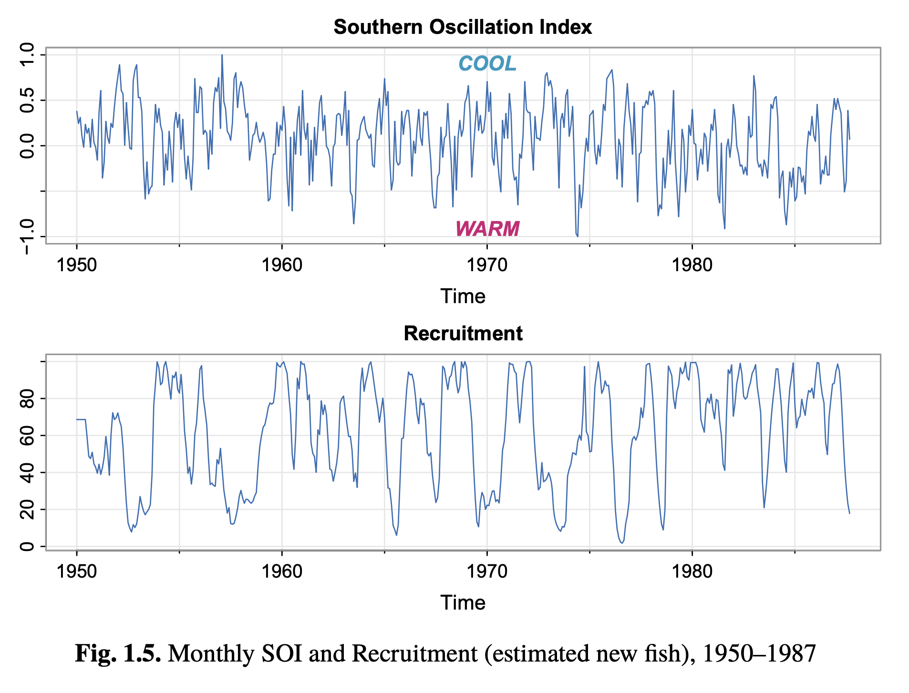

* **Reading**: Chapter 1.3-1.7 – Shumway and Stoffer

# Today

* Autocovariance, autocorrelation, cross-covariance, cross-correlation
* Stationarity

## Covariance of linear combinations of random variables

If we have random variables $U=\displaystyle\sum_{j=1}^m a_j X_j$ and $V=\displaystyle\sum_{k=1}^r b_k Y_k$ that are linear combinations of (finite variance) random variables ${X_j}$ and ${Y_k}$, then the covariance of these is:

$\operatorname{cov}(U,V) = \displaystyle\sum_{j=1}^m \displaystyle\sum_{k=1}^r a_j b_k \operatorname{cov}(X_j, Y_k)$

## Autocovariance of a random walk

Recall that a random walk (with or without drift) is:

$x_t = \delta t + \displaystyle\sum_{i=1}^t w_i$

The $w_t$ are uncorrelated random variables.

$$
\begin{aligned}
\gamma(s,t) &= \operatorname{cov}(x_s, x_t) \\
&= \operatorname{cov}(\delta s + \displaystyle\sum_{i=1}^s w_i, \delta t + \displaystyle\sum_{i=1}^t w_i)\\
&= \sigma^2 \min(s,t)
\end{aligned}
$$

In this case, the autocovariance *does* depend on the particular $s$ and $t$ chosen. 

What if we want a bounded measure?

# Autocorrelation function 

We can calculate the autocorrelation function (ACF) as:

$\rho(s,t) = \frac{\gamma(s,t)}{\sqrt{\gamma(s,s)\gamma(t,t)}}$ 

This measures the linear predictability of the time series at time $t$ ($x_t$) using $x_s$. The Cauchy-Schwarz inequality states that:

$\operatorname{cov}(x,y) \leq \sqrt{\operatorname{Var}(x)\operatorname{Var}(y)}$

We can also extend this to looking at the linear predictability of one time series to another, by extending into the concepts of *cross-covariance* and *cross-correlation*.

# Cross-covariance

Between two time series $x_t$ and $y_t$:

$\gamma_xy(s,t) = \operatorname{cov}(x_s,y_t) = \mathbb{E}[(x_s-\mu_{xs})(y_t-\mu_{yt})]$

This tells us how the values in $y$ relate to the values in $x$ over time. 

Let's think about a simple example:

$y_t = x_{t-2}$

What is $\gamma_{xy}(k)$ (for lag $k$)? At what lag is $\gamma_{xy}$ maximized? 

We can also have the normalized version:

# Cross-correlation

$\rho_{xy}(s,t) = \frac{\gamma_xy(s,t)}{\sqrt{\gamma_x(s,s)\gamma_y(t,t)}}$ 

This is bounded such that $-1 \leq \rho(s,t) \leq 1$

# Stationarity

Recall that for a moving average, the autocovariance $\gamma_v(s,t)$ depends only on the time separation between $s$ and $t$ (also called the *lag*). This is important because this implies the concept of *stationarity*. 

A *strictly stationary* time series is one where every collection of values has identical probabilistic behavior to the time-shifted set:

$\{x_t, x_{t_2}, \dots, x_{t_k}\} \overset{d}{=} \{x_{t_1+h}, x_{t_2+h}, \dots, x_{t_k+h}\}$

(that is, same mean, variance, higher-order moments for all $t$). Examples: iid process

This is not true for most applications and is too strict of a definition. So instead, we will introduce the concept of weak stationarity. In your book this is just called "stationary" as short hand.

## Weakly stationary

A weakly stationary time series $x_t$ is a finite variance process where:

* The mean function is constant and doesn't depend on $t$
* The autocovariance function $\gamma(s,t)$ depends on $s$ and $t$ only through their difference $|s-t|$.

This is convenient because we can then estimate things about time series where we don't have multiple repeated observations (and thus we can't actually estimate the variability for a given time sample directly). In a stationary time series, the mean function is independent of time, so we have:

 $\mu_t = \mu$

 We can also simplify the autocovariance function so that it is only dependent on the time shift / lag. For example, if $s=t+h$, $h$ is the *lag* between $s$ and $t$. We then have:

 $\gamma(t+h, t) = \operatorname{cov}(x_{t+h}, x_t)=\operatorname{cov}(x_h,x_0) = \gamma(h,0) = \gamma(h)$

The autocovariance of a (weakly) stationary time series is thus:

$\gamma(h) = \operatorname{cov}(x_{t+h}, x_t) = \mathbb{E}[(x_{t+h}-\mu)(x_t-\mu)]$

* In your lab, you will look at the stationarity of white noise (strictly stationary), moving average (weakly stationary), random walks (not stationary), and linear trends (not stationary).
* If mean and/or autocovariance change with time, your time series is not stationary

# Estimating covariance of a single time series

Much of the time we don't have multiple samples of our time series, so we can't estimate $\mu_t$ separately for each $t$. If we assume stationarity, $\mu_t = \mu$, so we can use the sample mean instead of $\mu_t$:

$\hat{\gamma}(h) = \frac{1}{n}\displaystyle\sum_{t=1}^{n-h}(x_{t+h}-\bar{x})(x_t-\bar{x})$,

where $\bar{x} = \frac{1}{n}\sum_{t=1}^n x_t$ is the sample mean. Also, $\hat{\gamma}(-h) = \hat{\gamma}(h)$ for $h=0,1,\dots,n-1$.

This is nice because we can always calculate the sample autocovariance. However, whether it is interpretable or meaningful will depend on whether the stationarity assumption is approximately true. 

# Estimating relationships between two time series

We can use cross-correlation to estimate relationships between two series $x_t$ and $y_t$. For signals that are jointly weakly stationary:

$\hat{\rho}_{xy}(h) = \frac{\hat{\gamma_{xy}}(h)}{\sqrt{\hat{\gamma_x}(0)\hat{\gamma_y}(0)}}$

Here is an example of the autocorrelation functions for the Southern Oscillation Index, fish recruitment, and their relationship (cross-correlation function):

# Next time:

* Linear regression (Chapter 2 SS)