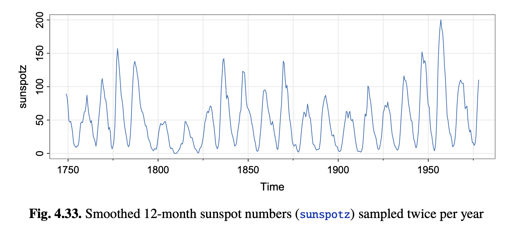

* **Reading**: Chapter 2 (somewhat), Chapter 4.1 – Shumway and Stoffer

# Nonlinear regression

Recall last time we spoke about *Multiple Linear Regression*:

$$y_i = \beta_0 + \beta_1 x_{i_1} + \beta_2 x_{i_2} + \cdots + \beta_n x_{i_p} + w_i $$

In this case, we assumed a linear relationship between $y$ and our $\beta$ estimates. However, in many real datasets and models, certain parameters are related to our output in a nonlinear fashion. One example is seen in the sunspots dataset, in which the time series data show strong periodicity.



## When might this type of problem come up?

* Climate data (El Nino/SOI)
* Astronomy
  * Variable stars - brightness fluctations that can be used to estimate the period ($1/f$), which relates to the intrinsic luminosity of a star. This can then be used to estimate the distance to the star. Edwin Hubble in the 1920s measured the distance to the Andromeda galaxy and showed they were too far to be inside the Milky Way, which suggested we are in just one galaxy among many. 
* Signal processing - speech and audio
  * Estimating the pitch and formants of a person's voice is part of ASR (automatic speech recognition)
* Economics - but generally less stable

For example, we might have:

```{math}
:label: eq2
y_t = \beta_0 + \beta_1 \cos (2\pi ft) + \beta_2 \sin (2\pi ft ) + \epsilon_t \quad \text{where } \epsilon_t \overset{i.i.d}\sim N(0, \sigma^2)\label{eq2}
```

The parameters we will fit here include $\beta_0, \beta_1, \beta_2, \sigma$ and frequency parameter $f$. If $f$ is already known, then {eq}`eq2` reduces to multiple linear regression: $y=X_f\beta + \epsilon$ with:

$$
  y = \begin{pmatrix} 
    y_1 \\ \vdots \\ y_n 
  \end{pmatrix},
  X_f = \begin{pmatrix} 
    1 & \cos(2\pi f(1)) & \sin(2\pi f(1)) \\
    \vdots & \vdots & \vdots \\
    1 & \cos(2\pi f(n)) & \sin(2\pi f(n)) \\
    \end{pmatrix},
  \beta = \begin{pmatrix}
    \beta_0 \\ \beta_1 \\ \beta_2
    \end{pmatrix} \quad \text{and } 
  \epsilon = \begin{pmatrix}
    \epsilon_1 \\ \vdots \\ \epsilon_n
    \end{pmatrix}
$$

And we can proceed as before. If $f$ is *not* known, then this is a nonlinear regression model. 

This particular type of model $y_t = \beta_0 + \beta_1 \cos (2\pi ft) + \beta_2 \sin (2\pi ft ) + \epsilon_t$ is called a sinusoid, which has some special properties (later we'll revisit this when we talk about power spectral analysis).

# About Sinusoids

A sinusoid can be given by the following function at time $t$:

$$s(t) := \beta_0 + R \cos (2\pi f t + \phi)$$

Where:

* $R$ is the *amplitude* of the sinusoid, which represents the height of the oscillation from the center line.
* $f$ is the *frequency* of the sinusoid, which represents how many cycles (oscillations) are observed per unit time. If time is measured in seconds, then $f$ is given in units of Hertz (Hz). 
* $1/f$ is the *period* of the oscillation, which is the length of time it takes to complete one full oscillation (one up peak and down peak)
* $\phi$ is the *phase* of the oscillation. If $\phi=0$, the sinusoid is at its maximum value at $t=0$. The $\phi$ value allows us to account for leftward or rightward shifts of the whole oscillation in time.
* $2\pi f$ is called the angular frequency. Sometimes we also write this as $\omega=2\pi f$. This measures the rate of change of the angle inside the cosine.

You may have noticed here that this sinusoid doesn't look exactly like the equation we started with earlier {eq}`eq2`. However, we can use the trigonometric identity $\cos(a + b) = (\cos a)(\cos b) - (\sin a)(\sin b)$ to rewrite the equation as:

$$a &= 2\pi ft, \quad b=\phi$$

$$
\begin{aligned}
s(t) &= \beta_0 + R ( (\cos 2\pi ft \cos \phi) - (\sin 2\pi ft \sin \phi))\\
&= \beta_0 + R \cos \phi \cos 2\pi ft - R \sin \phi \sin 2\pi ft
\end{aligned}
$$

We can now express $\beta_1=R\cos\phi$ and $\beta_2=-R\sin\phi$, then we have the equation we discussed before:

$$s(t) = \beta_0 + \beta_1 \cos 2\pi ft + \beta_2 \sin 2\pi ft$$

We can also always rederive $R$ or $\phi$ if we want them:

$$R=\sqrt{\beta_1^2+ \beta_2^2}, \quad \phi = \arctan\left(-\frac{\beta_2}{\beta_1}\right)$$

# A note on dealing with sampling
The sinusoidal model is written above in continuous time, but usually we are collecting data in discrete time samples. If our sampling rate is $f_s$ (in samples per second, or Hz), then our actual observations are occuring at times $t_n = \frac{n}{f_s}$ for $n=0, 1, \dots$, so we are actually fitting:

$$y_n = \beta_0 + R \cos \left( \frac{2\pi f n}{f_s} + \phi \right) + \epsilon_n$$

This sampling rate $f_s$ fundamentally constrains what frequencies you can estimate. This has a special name:

## The Nyquist limit

You can only reliably estimate frequencies up to half of the sampling rate:

$$f_\text{max} = \frac{f_s}{2}$$

This $f_\text{max}$ is also called the **Nyquist Frequency**. If the true signal contains a component at frequency $f$ and your sampling rate is too low ($f > f_s/2$), then that component doesn't vanish -- rather, induces **aliasing**, which is where you will get an estimate of $f$ that is $| f - n f_s|$ for any integer $n$. We'll come back to this when we talk about power spectral analysis, but for now, just remember that if you want to estimate a particular sinusoidal component with frequency $f$, that frequency must be no more than one half of the sampling rate. 

Also, this becomes important when we are trying to estimate $f$ via least squares, because if framed in this way we only have to test $f \sim \text{unif}[0, 1/2]$

See a demo of [how the Nyquist Limit works](./09_nyquist.html)

# Least squares estimation of $\beta, f, \sigma$

To estimate the parameters of this regression, we will use the same basic estimation as in prior lectures (least squares):

$S(\beta_0, \beta_1, \beta_2, f, \sigma) := \sum_{t=1}^n (y_t - \beta_0 - \beta_1 \cos 2\pi ft - \beta_2 \sin 2\pi ft)^2$

We have to minimize over all five variables $\beta_0, \beta_1, \beta_2, f, \sigma$. In practice, we will first start with estimating $f$ by taking a bunch of possible values of $f$, then calculating the goodness of fit $RSS(f)$ of that resulting linear regression model with fixed $f$. Then, with $f$ fixed at $\hat{f}$ we will calculate the remaining parameters. 

1. Take a grid of possible values of $f$ in the range $[0, 1/2]$
2. For each frequency value $f$ in the grid:
    - Create a matrix $X_f$
    - Perform regression of $y$ on $X_f$ and compute the residual sum of squares $RSS(f)$
3. Take $\hat{f}$ to be the grid value that minimizes $RSS(f)$ over all values on the grid.
4. Take $\hat{\beta}$ and $\hat{\sigma}$ using the usual regression estimates of $\beta$ and $\sigma$ from typical linear regression of $y$ on $X_{\hat{f}}$. 