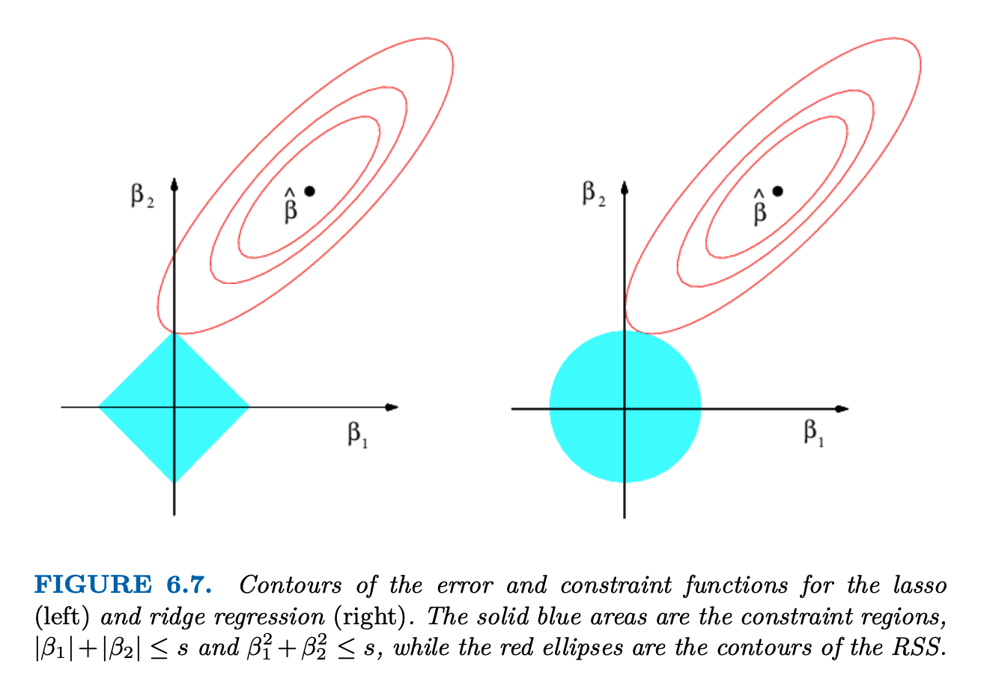

* **Reading**: Chapter 6 (and 6.2) - An Introduction to Statistical Learning

# Cross-validation

How can we avoid overfitting? One way is to seek models that minimize the MSE on *held out data*, that is, data that was not used to train our model. 

How do we choose this in practice? For cross validation in general, we might choose to use something like *k-fold cross validation*, which is where we split the data into *k* chunks, train on $k-1$ of those sets, and compute test error based on the last fold. However, in time series there are a few things to consider:

* Often we want to train on past data to predict future data (so randomly permuting time doesn't make sense)
* We also need to preserve the autocorrelation structure in time series data, so we should not randomly choose some percentage of observations. We want to chunk the data in a way that maintains the temporal order in the fitting.

In the past, cross-validation was not used as it was computationally prohibitive to test many possible training/test splits of the data. Nowadays this is not an issue, and cross-validation can be a very clean way to test model performance without requiring: 

* normally distributed errors
* homoscedasticity
* correct model specification
* known numbers of parameters

It works for any model without you needing to know anything about the error distribution. This is why this is more popularly used now as compared to parametric approaches such as AIC and BIC (which assume Gaussian errors).

# Alternative fitting procedures

So what do we do in these cases where we have potentially many parameters and few observations, but we want an accurate and interpretable model? We can constrain or *shrink* the coefficients to reduce the variance of our estimates at the cost of slightly increasing bias. This also can allow for improved model interpretability - by forcing some coefficients to be very small or to zero, we can more easily interpret our model by removing irrelevant covariates. We will discuss two major ways: 

1. Ridge regression (L2 regularization)
2. LASSO regression (L1 regularization)

# Ridge regression

Recall that least squares estimates our $\beta$ parameters by minimizing the residual sum of squares:

$$\text{RSS} = \displaystyle\sum_{i=1}^n \left(y_i - \beta_0 - \displaystyle\sum_{j=1}^p \beta_j x_{ij}\right)^2$$

Ridge regression is very similar, but we add a *penalty term* $\lambda$ for our minimization function. For ridge esimates, we take the values that minimize:

$$\displaystyle\sum_{i=1}^n \left(y_i - \beta_0 - \displaystyle\sum_{j=1}^p \beta_j x_{ij}\right)^2 + \lambda \displaystyle\sum_{j=1}^p \beta_j^2 = \text{RSS} + \lambda \displaystyle\sum_{j=1}^p \beta_j^2$$

$\lambda \ge 0$ is a *tuning parameter*, also called the *ridge parameter* or *ridge regularization term*, which we must also fit separately. 

This can also be written as:

$$\text{RSS} + \lambda \| \hat{\beta} \|_2^2$$

Where $$\| \hat{\beta} \|_2 = \sqrt{\sum_{j=1}^p \beta_j^2}$$ is the $\ell 2$ norm. 

$\lambda \displaystyle\sum_{j=1}^p \beta_j^2$ is the second term, which is small when $\beta_1, \dots, \beta_p$ are close to zero. The effect of this penalty is that the $\beta$ coefficients will tend to shrink towards zero (but they are not usually exactly zero). The value of $\lambda$ determines the impact of the two terms on the $\beta$ estimates.

* $\lambda = 0$ = no regularization, same as OLS
* As $\lambda \longrightarrow \infty$, the ridge regression coefficients will approach 0
* Can plot $\beta$ values as a function of $\lambda$ 
* Note that we don't apply the shrinkage penalty to $\beta_0$

# Ridge regression solution

The solution for the $\beta$ estimates is given by:

$$\hat{\beta^{ridge}} = (X^\intercal X + \lambda I )^{-1} X^\intercal y$$

We get this by minimizing the ridge objective (MAP estimation - what parameters make the data most probable, given our prior on the parameters):

$$L(\beta) = (y-X\beta)^\intercal (y-X\beta) + \lambda \beta^\intercal \beta$$

Take the derivative w.r.t $\beta$ and set to 0:

$$\frac{\delta L}{\delta \beta} = -2 X^\intercal (y-X\beta)+2\lambda\beta = 0$$
$$X^\intercal y - X^\intercal X \beta - \lambda\beta = 0$$
$$X^\intercal y = (X^\intercal X + \lambda I)\beta$$
$$\hat{\beta^{ridge}} = (X^\intercal X + \lambda I )^{-1} X^\intercal y$$

## Important considerations

* Ridge regression is strongly affected by the *scale* of the predictors
* In OLS, multiplying $X$ by a constant $c$ scales $\beta$ by $1/c$ - OLS is *scale equivariant*
* On the other hand, ridge estimates can vary substantially when multiplying a given predictor by a constant -- why?
  * Scaling a given $X$ in ridge changes $X^\intercal X$, the $j$-th diagonal grows by $c^2$, so the penalty $\lambda$ now has relatively less influence over that coefficient!
* Thus it is best practice to first rescale the predictors - usually by at least *scaling* (dividing by std), but also typically by *centering* (subtracting the mean) and *scaling*. - this is the same as Z-scoring the data

# Advantages of ridge

* Works well when best subset selection is computationally infeasible
* Closed-form solution - fit only a single model (aside from CV repetitions)
* Helpful in situations where there are many parameters and few time points, and where predictors are correlated so we don't necessarily want to get rid of them
* *bias-variance* trade-off: In the case of large $p$ compared to $n$ (either they are close or $p>n$), the OLS solution will be highly variable or won't have a unique solution. As $\lambda$ increases, the flexibility of the ridge regression fit decreases, so we have decreased variance but increased bias. 

# Another flavor - lasso regularization

One disadvantage of ridge is that it includes all parameters in the model - while they shrink toward zero, the ridge solution won't set any parameters to exactly zero (unless $\lambda = \infty$). Instead, we can use an alternative to ridge, with is the Lasso (Least Absolute Shrinkage and Selection Operator) or L1 regularization. This minimizes: 

$$\displaystyle\sum_{i=1}^n \left( y_i -\beta_0 - \displaystyle\sum_{j=1}^{p} \beta_j x_{ij}\right)^2 + \lambda \displaystyle\sum_{j=1}^p |\beta_j| = \text{RSS} + \lambda \displaystyle\sum_{j=1}^p |\beta_j|$$

Note the similarities here between ridge and lasso, but the difference is that the $\beta_j^2$ term has been replaced by $|\beta_j|$. This uses an $\ell_1$ penalty instead of an $\ell_2$ penalty. The $\ell_1$ norm of a coefficient vector $\beta$ is $\left|\beta \right| = \sum |\beta_j|$

A big difference here is that lasso *forces some coefficients to exactly zero*. This results in performing variable selection and yields *sparse models* - models that contain only a subset of the variables. 

# A geometric comparison

Lasso, unlike ridge, results in coefficients that are exactly equal to zero. To show geometric intuition for this, we can think about the contours of the error and constraint functions for lasso and ridge regularization. 

The ellipses here around $\hat{\beta}$ represent a contour for the error function (think of a paraboloid or bowl shaped function, where the minimum is the OLS solution). All points on a particular red ellipse will have the same RSS value. 

If the constraint regions are sufficiently large (corresponding to the smallest $\lambda=0$), then the estimates are the same as OLS. However, in most cases ridge and lasso will be different from OLS since the OLS estimate lies outside of the diamond and the circle.

Since ridge regression has a circular constraint with no sharp points, the error surface will intersect with the circle outside of the axes. On the other hand, lasso has sharp corners, and especially in even higher dimensions, it is more likely that our error surface will intersect with one of these sharp corners (where one of the variables is zero) compared to the sides.

## Which is better?

It depends! Ridge tends to be better in scenarios where the response is a function of many predictors, or where predictors have some degree of collinearity, so it doesn't make sense to choose one over the other (for example - time lags may be correlated and it might not make sense to arbitrarily choose one). 

Lasso tends to be better when variable selection is required or when it is expected that many of the predictors are not useful. This can result in models that are easier to interpret.

# How do we find $\lambda$?

* Cross-validation! Typically, we will choose a range of values for $\lambda$, then fit models using cross-validation and select the parameter for which CV-error is smallest
* Remember for time series we *must* do cross validation that preserves the time series structure / autocorrelations in our stimulus!!
* You will see this in your lab!
