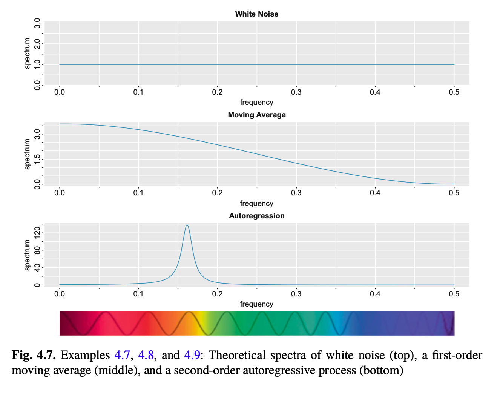
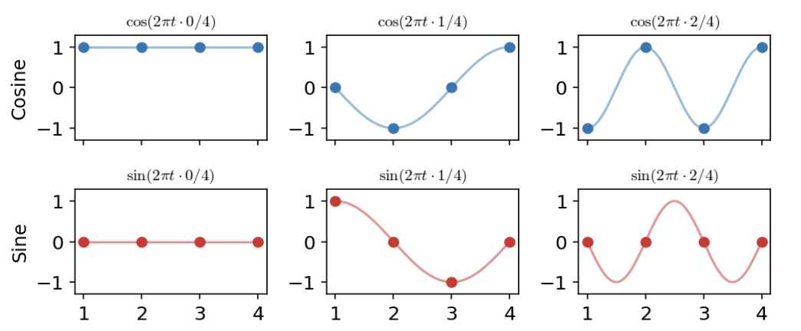

* **Reading**: Ch 4 - Shumway and Stoffer

## Moving Average

For the moving average, let's consider a causal moving average (remember, this is the version where we only consider values from the past in our moving average):

$$x_t = w_t + \theta w_{t-1}$$

The autocovariance function for this is:

$$
\gamma(h) = \begin{cases}
(1+\theta^2)\sigma^2 & h=0\\
\theta\sigma^2 & |h|=1\\
0 & |h| > 1
\end{cases}
$$

The spectral density is therefore: 

$$
\begin{aligned}
f(\omega) &= (1+\theta^2)\sigma^2 + \theta\sigma^2(e^{-2\pi i \omega}+e^{2\pi i \omega}) \\
&= \sigma^2(1+\theta^2+2\theta\cos(2\pi\omega))
\end{aligned}
$$

in the second line, we used $\cos(\theta) = (e^{i\theta}+e^{-i\theta})/2$ from Euler's formula $e^{i\theta}=\cos(\theta)+i\sin(\theta)$.

What results here is that the MA process has a spectral density that decays from zero, with larger $\theta$ corresponding to a steeper decay from $\omega=0$ to $\omega=1/2$. 

## An overview of the DFT and periodogram

An intuitive relationship between the DFT and the periodogram is that the DFT gives you a complex value that incorporates both the amplitude and phase of each frequency present in the signal, whereas the periodogram represents only the real-valued power at that frequency, removing the phase information. Let's try this with a tiny example:

Suppose we have $x_1=2$, $x_2=3$, $x_3=1$, and $x_4=4$. We can use these to see how the periodogram is derived from squaring the DFT.

The DFT at frequency $j/n$ is:

$$d(j/n) = \frac{1}{\sqrt{n}}\sum_{t=1}^n x_t e^{-i2\pi t j/n}$$

The periodogram is the rescaled squared modulus:

$$P(j/n) = (4/n) |d(j/n)|^2$$ 

Since we have $n=4$ time points, the Fourier frequencies are $j/n = 0/4, 1/4, 2/4, 3/4$. Since by symmetry $P(j/n) = P(1-j/n)$ we only need $j=0,1,2$. 

We can now look at what the sine and cosine waves look like at each frequency.

Now let's compute the DFT for each $j$:

For $j=0$:

$$
\begin{aligned}
d(0) &= \frac{1}{\sqrt{4}}\sum_{t=1}^4 x_t e^{-i2\pi t 0} \\
&= \frac{1}{\sqrt{4}}\sum_{t=1}^4 x_t\\
&= \frac{1}{2}(2+3+1+4) = 5\\
\end{aligned}
$$

For $j=1$:

$$d(1/4) = \frac{1}{\sqrt{4}}\sum_{t=1}^4 x_t e^{-i2\pi t 1/4}$$

| t | $e^{-i\pi t/2}$   | $\cos(\pi t/2)$ | $\sin(\pi t/2)$ | 
|---|--------------------|-----------------|-----------------|
| 1 | $-i$               |  $0$            | $-1$            |
| 2 | $-1$               | $-1$            |  $0$            |
| 3 | $i$                |  $0$            |  $1$            |
| 4 | $1$                |  $1$            |  $0$            |

$$d(1/4) = \frac{1}{2}(2(-i)+3(-1)+1(i)+4(1)) = \frac{1}{2}(1-i) = 0.5 - 0.5i$$

For $j=2$:

$$
\begin{aligned}
d(2/4) &= \frac{1}{\sqrt{4}}\sum_{t=1}^4 x_t e^{-i2\pi t 2/4}\\
&= \frac{1}{2}\sum_{t=1}^4 x_t e^{-i\pi t}\\
&= \frac{1}{2}\sum_{t=1}^4 x_t (-1)^t\\
&= \frac{1}{2}(2(-1)+3(1)+1(-1)+4(1))\\
&= \frac{1}{2}(4) = 2
\end{aligned}
$$

Now to go to the periodogram from the DFT, we can do:

$$\begin{aligned}
P(j/n) &= (4/n) |d(j/n)|^2\\
P(0/4) &= (4/4) | 5 | ^2 = 25\\
P(1/4) &= (4/4) | 0.5 - 0.5i|^2 = 0.5\\
P(2/4) &= (4/4) | 2 | ^2 = 4\\
P(3/4) &= P(1/4)\\
\end{aligned}
$$

The way to interpret this is that the DFT is a complex number that encodes both amplitude and phase at each frequency. 

## Periodogram demo

Read Chapter 4.4 for more info on periodogram smoothing.

