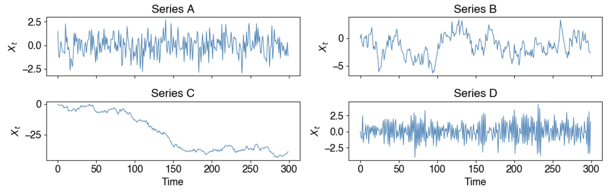
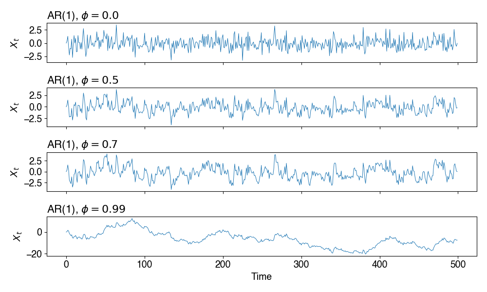
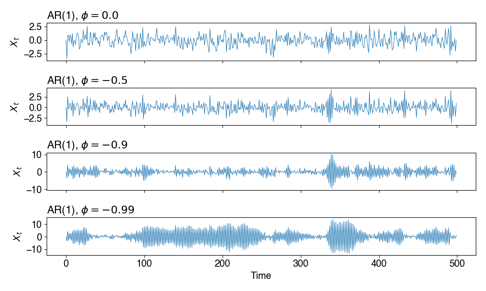
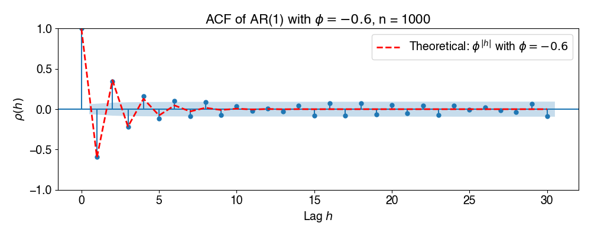

* **Reading**: Ch 3 - Shumway and Stoffer

# Intro to Autoregressive models

Up until now we've thought about signals in both the frequency and the time domain, and most recently we've been looking at decomposing signals into sinusoids and looking at power spectra. Today, we look at autoregressive models, which allow us to predict a signal from its past.

Autoregression = regression on self.

**Ordinary regression:** $Y=X\beta$

**AR(1) process:** $x_t = \phi x_{t-1} + w_t$

In the AR process, $x_t$ can be written as a function of $p$ past values $x_{t-1}, x_{t-2}, \dots, x_{t-p}$. $p$ determines the number of steps in the past needed to forecast the current value. This is also called the *order* of the AR($p$) process. 

**AR(p) process:** $x_t = \phi_1 x_{t-1} +\phi_2 x_{t-2} + \dots + \phi_p x_{t-p} + w_t$

* $x_t$ is stationary
* $w_t \sim \text{white noise}(0,\sigma^2_w)$
* $\phi_1, \phi_2, \dots, \phi_p$ are constants $\neq 0$

We can also add an intercept, $\alpha$ if $\bar{x_t} \neq 0$.

Let's look at some examples of these in the accompanying Lecture 16 notebook. In the plot below, series A is white noise, series B is an AR(1) model with $\phi=0.9$, series C is a random walk (AR with $\phi=1$, which is not stationary, and series D is an AR(1) model with $\phi=-0.8$.

# AR(1) process

The simplest AR model is the AR(1) model, where $x_t$ depends on $\phi x_{t-1}$ plus some white noise (or "shock"). This could be used to look at temperature (if it's 72 degrees F right now, what's your best guess for one hour from now?), stock returns (if the market went up 2% today, what does that tell you about tomorrow?), etc.

**What does $\phi$ control?**

| $\phi$           | Behavior                                  |
|------------------|-------------------------------------------|
| $\phi = 0$       | White noise (no memory)                   |
| $0 < \phi < 1$   | Positive memory - values drift slowly     |
| $\phi \to 1$     | Very long memory                          |
| $\phi = 1$       | Random walk (nonstationary)               |
| $-1 < \phi < 0$  | Oscillatory memory - alternating values   |

So what happens if $|\phi| > 1$? In this case, the influence of past shocks doesn't decay and the variance of $x_t$ increases without bound. The AR(1) process is stationary iff $|\phi| < 1$. Below are some example AR1 time series from the accompanying lecture notebook:

Some observations:

* As $\phi$ increases, the series becomes smoother - why? 
* The variance of the series also increases with $\phi$ - why?
* At $\phi = 0.99$, this looks close to a random walk

# Properties of the stationary AR(1) model
When $|\phi| < 1$, we can derive closed-form expressions (see the derivations of these in your book, Ch 3 example 3.1):

| Property       | Formula                                                        |
|----------------|----------------------------------------------------------------|
| Mean           | $\mu_x = 0$ (assuming zero-mean)                               |
| Variance       | $\gamma(0) = \frac{\sigma_w^2}{1 - \phi^2}$                    |
| Autocovariance | $\gamma(h) = \frac{\sigma_w^2\phi^h}{1 - \phi^2}$ for $h\geq 0$|
| ACF            | $\rho(h) = \frac{\gamma(h)}{\gamma(0)} = \phi^{h}$             |

Note that the ACF of an AR(1) process decays exponentially! We can also see here that $|\phi| < 1$ is needed for stationarity, because the denominator in the variance equation goes to zero as $|\phi| \to 1$. Let's look at an example for the ACF in the notebook.

# The backshift operator

Next, to look into the properties of the AR models, we're going to define the *backshift operator* $B$:

$B x_t = x_{t-1}$

Then we can rewrite the AR(1) model as:

$$\begin{aligned}
x_t - \phi x_{t-1} &= w_t\\
x_t - \phi B x_t &= w_t\\
(1 - \phi B) x_t &= w_t
\end{aligned}
$$

or the AR(p) model:

$$(1 - \phi_1 B - \phi_2 B^2 - \dots - \phi_p B^p) x_t = w_t$$

# The autoregressive operator/characteristic polynomial

We then define the *autoregressive operator* as:

$$\phi(B) = (1 - \phi_1 B - \phi_2 B^2 - \dots - \phi_p B^p)$$ 

so we have $\phi(B)x_t=w_t$

This is also sometimes called the *characteristic polynomial* because we can use it to find the roots of the polynomial, which will then tell us some more interpretable information about stationarity and oscillatory frequency. Let's first consider the AR(1) model. There we have:

$$\phi(B) = (1 - \phi_1 B)$$

The root is at $B = 1/\phi$. 

**Important:** For stationarity, we require all roots to lie outside the unit circle, that is, $|1/\phi| > 1 \iff |\phi| < 1$. 

Now let's try this with an AR(2) model:

$$x_t = \phi_1 x_{t-1} + \phi_2 x_{t-2} + w_t$$

the characteristic polynomial is:

$$\phi(B) = (1 - \phi_1 B - \phi_2 B^2)$$

Now when we solve for the roots of this polynomial, we could potentially get:

1. Two real roots (overdamped behavior) - this means the process will decay smoothly back to the mean without oscillating
2. Complex conjugate roots - this will lead to oscillatory decay

## Example AR(2) model 

Let's try an example: 

$$x_t = 0.6 x_{t-1} -0.5x_{t-2} + w_t$$

We will do the following:

1. Write the characteristic polynomial
2. Find its roots. Are they real or complex?
3. Is this process stationary?
4. What kind of behavior do you expect?

**Characteristic polynomial:**

$$\phi(B) = (1 - 0.6 B + 0.5 B^2)$$

We then solve for its roots using the quadratic formula. For this particular AR(2) model, we get complex roots:

$0=\frac{0.6 \pm \sqrt{(-0.6)^2 - 4(0.5)(1)}}{2(0.5)}$ 

The roots are $0.6 \pm 1.28i$, which are complex. The modulus tells us whether the process is stationary:

$|z| = \sqrt{a^2+b^2} = \sqrt{0.6^2 + 1.28^2} = 1.41$

Because this is greater than 1, we determine that yes, the process is indeed stationary. The modulus also has another intuitive meaning - a modulus closer to 1 means less damping and a more persistent oscillation, whereas a modulus closer to 0 means more damping (the signal dies out fast).

# Next time - ARMA
Next time, we will discuss AR(p) models and the extension to ARMA models, which include a moving average comopnent that allows us to also model recent shocks in our autoregressive process.