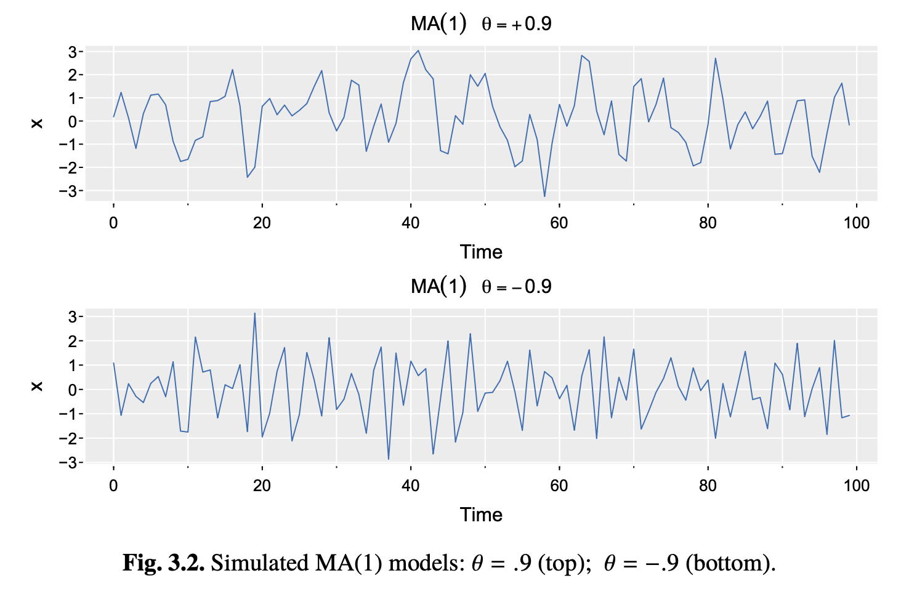

* **Reading**: Ch 3 - Shumway and Stoffer

# Autoregressive Moving Average Models

Before the break, we started talking about AR models:

**AR(p) process:** $x_t = \phi_1 x_{t-1} +\phi_2 x_{t-2} + \dots + \phi_p x_{t-p} + w_t$

We showed that AR models are stationary iff the roots of their characteristic polynomial equation lie outside the unit circle.

If this is satisfied, we can rewrite our AR(p) model as:

$$x_t = \mu + \sum_{j=0}^{\infty} \psi_j \epsilon_{t-j}$$

for some $\mu$ and coefficients $\psi_1, \psi_2, \dots$ satisfying $\sum_j |\psi_j| < \infty$. This is sometimes also referred to as a *causal* process (though not in the same way that the word causal is used in a lot of statistics -- here it just means that the model can be expressed purely as a function of current and past information).

As an alternative, we will now introduce the idea of the moving average model of order $q$ (MA($q$)), which is defined as:

**MA($q$):** $x_t = w_t + \theta_1 w_{t-1} +\theta_2 w_{t-2} + \dots + \theta_q w_{t-q}$ where $w_t \sim \text{white noise}(0, \sigma_w^2)$ and $\theta_1, \theta_2, \dots, \theta_q (\theta_q \neq 0)$ are parameters. We can also write this equivalently as:

$$x_t = \theta(B)w_t$$

using the backshift operator, which we also defined last time as $B x_t = x_{t-1}$

## An aside - why does the backshift operator make sense?

The backshift operator allows us to express a shift in time as a linear operator, which allows us to form expressions like the characteristic polynomial to tell us whether a signal is stationary. 

### Linear operators

A function $f$ is a linear operator if it satisfies two properties for all inputs $x$, $y$, and scalars $a$:

1. Additivity: f(x+y) = f(x) + f(y)
2. Scalar homogeneity: f(ax) = a f(x)

Sometimes these are combined into one: $f(ax+by) = af(x) + bf(y)$.

The backshift operator $B$ is a linear operator because shifting a scaled or summed series is the same as scaling or summing the shifted series. This is what allows us to use tricks like the characteristic polynomial as a diagnostic tool for calculating the stationarity of an AR model and (as we will discuss later) the invertibility of the MA part of the model. 

# Back to the MA model

Let's consider an example MA(1) process:

$$x_t = w_t + \theta w_{t-1}$$

The MA model, unlike the AR model, is stationary for any values of $\theta_1, \dots, \theta_q$. We have $E(x_t)=0$, and the autocovariance is:

$$
\begin{aligned}
\gamma_x(h) = \begin{cases}
(1+\theta^2)\sigma^2_w & h=0,\\
\theta\sigma^2_w & h=1,\\
0 & h>1,
\end{cases}
\end{aligned}
$$

and the ACF is:

$$
\begin{aligned}
\rho_x(h) = \begin{cases}
\frac{\theta}{(1+\theta^2)} & h=1,\\
0 & h > 1.
\end{cases}
\end{aligned}
$$

Note that $x_t$ is correlated with $x_{t-1}$, but not $x_{t-2}, x_{t-3}, \dots$. On the other hand, in an AR(1) model, the correlation between $x_t$ and $x_{t-k}$ is never 0. An example below is shown for an MA(1) model for $\theta=0.9$ and $\theta=-0.9$. The time series is smoother for $\theta=0.9$ than $\theta=-0.9$, but we don't have the same correlation structure as an AR model.

# Invertibility of the MA model

Another important characteristic of the MA model is its invertibility. Invertibility means $\theta(B)$ can be inverted as a power series, giving $w_t = \theta(B)^-1 x_t$. 

Let's first look at an important property - for an MA(1) model, $p_x(h)$ is the same for $\theta$ and $1/\theta$. For example, you could try calculating this for $\theta=5$ and $\theta=1/5$. Similarly, if we have $\sigma_w^2=1$ and $\theta=5$, this will yield the same autocovariance as $\sigma_w^2=25$ and $\theta=1/5$. This means that we cannot distinguish between the two MA(1) processes:

$$x_t=w_t +\frac{1}{5} w_{t-1},\quad w_t \overset{iid}{\sim} N(0,25)$$

and

$$y_t=v_t +5 v_{t-1},\quad w_t \overset{iid}{\sim} N(0,1)$$

- they are stochastically equal because of normality. Because we only observe the time series $x_t$ or $y_t$, we do not observe the noise independently and cannot distinguish between these models, so we have to choose one. We want to choose the version where $|\theta| <1$, because this is the version we can invert into an infinite AR representation:

$$w_t = \sum_{j=0}^\infty (-\theta)^j x_{t-k}$$

This is the MA equivalent of requiring AR models to be causal/stationary by having their roots outside the unit circle. So in this particular case, we'd choose $\theta=1/5$ and $\sigma_w^2=25$. 

# ARMA models

We can now use these two concepts (the AR and MA models) to extend our models to Autoregressive Moving Average (ARMA) models, which contain elements of both. The autocovariance of an AR model generally decays away from $h=0$, while the autocovariance of an MA process becomes exactly 0 after a certain lag.

*Definition:* A time series is ARMA(p,q) if it is stationary and:

$$x_t=\mu + \phi_1(x_{t-1}-\mu) + \dots + \phi_p (x_{t-p}-\mu) + w_t + \theta_1 w_{t-1} +  \dots + \theta_q w_{t-q}$$

The parameters $p$ and $q$ are called the autoregressive and moving average orders. We also often set $\alpha = \mu (1-\phi_1 - \dots - \phi_p)$ and write:

$$x_t= \alpha + \phi_1 x_{t-1} + \dots + \phi_p x_{t-p} + w_t + \theta_1 w_{t-1} +  \dots + \theta_q w_{t-q}$$

We can also write the ARMA(p,q) more precisely as 

$$\phi(B)(x_t-\mu) = \theta(B)w_t$$

Since ARMA is just an extension of AR and MA models, ARMA(p,0) = AR(p) and ARMA(0,q) = MA(q). 

# When do we use ARMA models?

* To forecast stationary time series data by combining previous values (AR) and previous error terms (MA)
* Ex: sales, temperature, financial time series

# When not to use ARMA models?

* When data are nonstationary / have trends 
* When the data have strong seasonal patterns
* If the data have complex, nonlinear relationships

