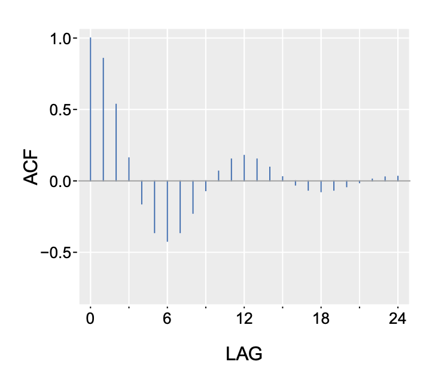
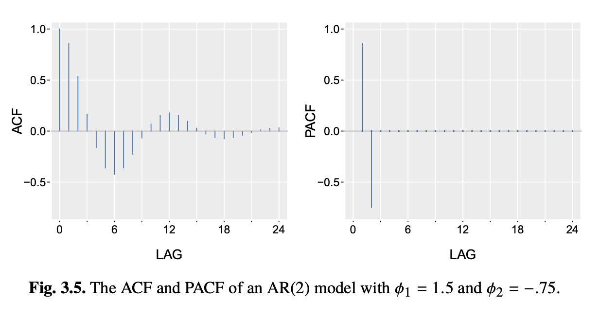

* **Reading**: Ch 3 - Shumway and Stoffer

# ARMA Models

Let's recall that we can represent an Autoregressive Moving Average (ARMA) model as:

$$x_t = \sum_{j=1}^p \phi_j x_{t-j} + \sum_{j=0}^q \theta_j w_{t-j}$$

where $w_t$ is a white noise sequence. The coefficients $\phi_1, \dots, \phi_j, \theta_0, \dots, \theta_q$ are fixed (nonrandom), $\phi_p,\theta_q\neq 0$, and we set $\theta_0=1$.

We talked last time about:

* Causality: a causal AR(p) process can be written as an MA($\infty$) process: $x_t=\sum_{j=0}^\infty \psi_j w_{t-j}$ where $\sum_{j=0}^\infty |\psi_j| < \infty$
* Invertibility: An invertible MA(q) process can be written as an AR($\infty$) process: $x_t = -\sum{j=1}^{\infty} \phi_j x_{t-j} + w_t$
* (Refer to Appendix B2 of SS for proofs, also see Ch3)

Because causality implies stationarity, this renders the ARMA(p,q) process stationary, as long as the roots of $\phi$ and $\theta$ lie outside the unit circle.

# Autocorrelation and Partial Autocorrelation

We previously discussed that the autocovariance for an AR(1) model decays away from $h=0$. On the other hand, the autocovariance for an MA(q) model is zero when $|h| > q$. 

Let's look at an example of the ACF for an AR(2) model with $\phi_1=1.5$ and $\phi_2=-0.75$

The ACF tells us about the total correlation between $x_t$ and $x_{t-h}$, but includes indirect information through intermediate lags. For example, in an AR(1) process, $x_t$ and $x_{t-2}$ are correlated, but only because both are correlated with $x_{t-1}$. The ACF at lag 2 is nonzero even though there is no direct dependence for lag 2! So what do we do?

We can use the *partial autocorrelation function (PACF)* here. This is written as $\phi_hh$, which represents the correlation between $x_t$ and $x_{t-h}$ after regressing out the effects of $x_{t-1}, x_{t-2}, \dots, x_{t-h+1}$. This is helpful because it tells you whether lag $h$ provides additional predictive information beyond lags $1$ through $h-1$. 

For random variables $X, Y$ and $Z=\{Z_1,\dots, Z_k\}$, the partial correlation between $X$ and $Y$ given $Z$ is obtained by regressing $X$ on $Z$ to obtain $\hat{X}$, regressing $Y$ on $Z$ to obtain $\hat{Y}$, and then calculating:

$$\rho_{XY|Z} = \text{corr}(X-\hat{X}, Y-\hat{Y})$$

Section 3.3.2 in your book provides more information on deriving this function.

Let's look at how that helps for the AR(2) model:

The following table shows how this information can be used in practice when determining if a time series has AR, MA, or ARMA components:

Function |  AR(p)    | MA(q)                | ARMA(p,q)
---------|-----------|----------------------|----------
ACF      | tails off | cuts off after lag q | tails off
PACF     | cuts off after lag q | tails off | tails off

# Examples on real data

Now let's turn to the accompanying notebook for this lecture to see these models in action.
