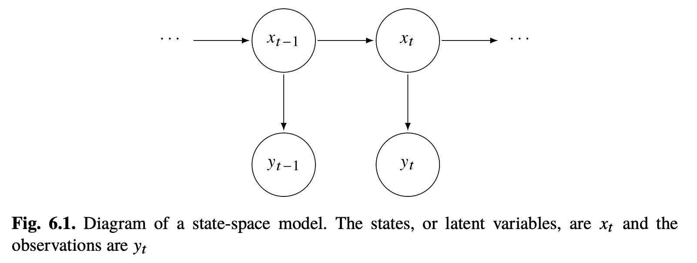

* **Reading**: Ch 5.5, 6-6.1 - Shumway and Stoffer

# State Space Models

Now we're going to discuss state space models, which are an extension of the ideas we've talked about so far in class. With state space models, we measure some noisy outputs $y_t$ that are generated by hidden states $x_t$ that evolve over time, also called latent variables. 

In ordinary regression, we have $y_t = X \beta + \epsilon$, which assumes $\beta$ is a fixed unknown constant (that we will learn through some fitting procedure). But what if $\beta$ drifts or changes over time? For example, what if we have $\beta_t = \beta_{t-1} + \eta_t$ and $y_t = X\beta_t + \epsilon$. This is now a state space model, where the "state" is the time-varying coefficient $\beta_t$. 

For ARIMA models, we discussed how an AR(1) process is given by $x_t = \phi x_{t-1} + w_t$. Suppose we don't observe $x_t$ directly, but we only observe $y_t = x_t + v_t$, which is our signal plus some measurement noise. This could be described by a state space model with state equation $x_t = \phi x_{t-1} + w_t$ and observation equation $y_t = x_t + v_t$. 

Overall, state-space models are characterized by two principles:

1. There is a hidden or latent process $x_t$ called the state process. This is assumed to be a Markov process - which means the future ${x_s; s>t}$ and past ${x_s, s<t}$ are independent conditional on the present, $x_t$. 
2. The observations $y_t$ are independent given the states $x_t$. That is, the dependence among observations is generated by states.

# Extension of AR model to VAR

Before we get into state space models, we should briefly mention an extension of the AR model to multiple dimensions, which is the VAR model (vector autoregressive model). Everything we've talked about so far with AR has been for a single series. Sometimes, however, we may have $k$ multiple series that influence each other. For the VAR model, we write:

$$x_t = \alpha + \Phi x_{t-1} + w_t$$,

Where $x_t$ is now a vector and $\Phi$ is a $(k\times k)$ *transition matrix* that expresses the dependence of $x_t$ on $x_{t-1}$. You can read more about this in Chapter 5.5 of Shumway and Stoffer. State space models are more general extension of this.

# Linear Gaussian Model

We can write the basic form of a linear Gaussian state-space model, also called the dynamic linear model (DLM) with the following *state equation*:

$$x_t = \Phi x_{t-1} + \Upsilon u_t + w_t$$

This is an order one, $p$-dimensional vector autoregression where $w_t$ are $p \times 1$ white Gaussian noise, $w_t \overset{iid}\sim N_p(0,Q)$. At $t=0$, we start with a normal vector $x_0 \sim N_p(\mu_0, \sigma_0)$. 

* $\Phi$ is the state transition parameter and is a $p \times p$ matrix. This describes the internal dynamics, i.e., how the state at $t-1$ produces the state at $t$
* $u_t$ is an $r \times 1$ fixed input series. This includes any covariates, experimental conditions, interventions, or other aspects you might supply rather than learning from the data. $\Upsilon$ is $p \times r$ and controls how those inputs influence the state.
* $w_t$ is the state noise and is Gaussian with covariance $Q$.

We do not observe this state vector $x_t$ directly, instead we see a linearly transformed version of it with noise added:

*Observation equation:*
$$y_t = A_t x_t+\Gamma u_t + v_t$$

* The data vector $y_t$ is $q$-dimensional, which can be $>p$ or $<p$, the state dimension. 
* $A_t$ is a $q \times p$ measurement or observation matrix. This specifies which linear combinations of the state we measure. By allowing $A_t$ to depend on $t$, we can handle things like missing data by dropping rows for time points where measurements are missing.
* $v_t$ is measurement noise with covariance $R$
* $\Gamma$ is $q \times r$ and lets the inputs $u_t$ affect the observation directly.

So external inputs can influence $y_t$ through either $\Upsilon u_t$ (through the state equation) or $\Gamma u_t$ (through the observation equation). As a concrete example, say $x_t$ is a person's true blood pressure, and $y_t$ is the blood pressure measured by a blood pressure cuff. Say a drug was administered at time $t$ - this would then change the state equation, because it will modify the actual blood pressure. On the other hand, an input like "which nurse took the reading" or "which blood pressure cuff was used" would belong in the observation equation, since it will affect what the meter reports, but not the underlying physiological cause. $\Gamma=0$ is commonly used, so inputs only drive the state. On the other hand $\Upsilon=0$ might show up when you're trying to model known measurement artifacts. 

# Bone marrow transplant example

As an example, we can look at changes in different biomedical markers when a cancer patient undergoes a bone marrow transplant. We have three variables:

* log(white blood cell count) [WBC] (essential for immune function)
* log(platelet) [PLT] (essential for blood clotting)
* hematocrit [HCT] (percentage of red blood cells in total blood volume)

These three variables measure distinct aspects of bone marrow function. A transplant is successful when the new marrow is incorporated and starts producing all three of these.

Unfortunately, as is the case with many real-world datasets (especially those with longitudinal follow up), many data points are missing - approximately 40% in this case. The missing values mostly occur after the 35th day. We can use a state space approach to model these three variables and estimate the missing values. Prior work has shown that platelet count at 100 days post transplant is a good indicator of subsequent long term survival, so we may also want to look at this. 

We can model these three variables using the state equation:

$$
\begin{aligned}
\begin{pmatrix}
x_{t1} \\
x_{t2} \\ 
x_{t3}  
\end{pmatrix}
&=& 
\begin{pmatrix}
\phi_{11} & \phi_{12} & \phi_{13} \\ 
\phi_{21} & \phi_{22} & \phi_{23}\\ 
\phi_{31} & \phi_{32} & \phi_{33}\\
\end{pmatrix}
\begin{pmatrix}
x_{t-1,1} \\ 
x_{t-1,2} \\ 
x_{t-1,3} \\ 
\end{pmatrix} +
\begin{pmatrix}
w_{t1}\\
w_{t2}\\
w_{t3}\\
\end{pmatrix}
\end{aligned}
$$

The diagonal values of the $\Phi$ matrix give you how much each marker's own recent value predicts its next value. For example, $\phi_{11}$ near 1 means the marker WBC is highly persistent and changes slowly from day to day. On the other hand a value near 0 would indicate today's value has little to do with yesterday (which would be strange for blood markers and might signal a problem with the data collection). 

The off-diagonal entries $\phi_{ij}$ are coefficients that show how much yesterdays value of marker $j$ predicts today's value of marker $i$. The matrices thus represent three stacked regressions, for example:

$x_{t1} = \phi_{11} x_{t-1,1} + \phi_{12} x_{t-1, 2} + \phi_{13} x_{t-1,3} + w_{t1}$

Meaning today's log(WBC) value is a weighted sum of yesterday's WBC, platelets, and hematocrit, plus some noise.

* $\phi_{11}$ is the effect of component 1 yesterday on component 1 today
* $\phi_{12}$ is the effect of component 2 yesterday on component 1 today
* $\phi_{13}$ is the effect of component 3 yesterday on component 1 today
* $\phi_{21}$ is the effect of component 1 yesterday on component 2 today
* $\phi_{22}$ is the effect of component 2 yesterday on component 2 today

We then have the observation equations $y_t = A_t x_t + v_t$, where the $3 \times 3$ matrix $A_t$ is either the identity matrix or zero matrix depending on whether a blood sample was taken on that day. 

For such a model, we would fit the unknown values through expectation maximization (EM) or through maximum likelihood methods:

* $\Phi$ - $(3 \times 3)$ matrix, 9 parameters
* $Q$ - $(3 \times 3)$ symmetric state noise covariance matrix (so only 6 parameters, diagonals and one set of off-diagonals)
* $R$ - $(3 \times 3)$ symmetric observation noise covariance matrix (so only 6 parameters, diagonals and one set of off-diagonals - often assumed diagonal)
* $\mu_0, \sigma_0$: mean and covariance of initial state $x_0$ ($3+6=9$ parameters - may be fixed according to some prior)
* $A$ - usually fixed as $I$, but may be fit

In python, we can use `statsmodels.tsa.statespace` to fit these models. 

# Filtering, smoothing, and forecasting

For state space models, we want to estimate our underlying unobserved signal $x_t$ given the data $y_{1:s} = {y_1, \dots, y_s}$ to time $s$. In practice, the steps for the state space models include:

1. Filtering, where we estimate $x_t$ using measurements up through time $t$ (here $s$=$t$)
2. Prediction/forecasting, where we have $s<t$ and want to estimate new data
3. Smoothing, where $s>t$. This allows us to estimate $x_t$ using the entire dataset, including observations after $t$. This can be used to better estimate missing values.

# Other examples

* Estimating global warming/global temperatures $x_t$ from land and sea temperature measurements $y_t$
* Brain computer interfaces (BCI) - we want to infer intended cursor velocity ($x_t$) from brain measurements from 100 electrodes in motor cortex $y_t$
* Health - we want to estimate true blood glucose level $x_t$ from $y_t$ intermittent measurements from a continuous glucose monitor with some sensor drift.
* Finance - we want to measure volatility $x_t$ of the S&P500 on day $t$, we observe $y_t$ daily log returns

# Advantages of state space models

What are the advantages of state space models as opposed to other models we've discussed in this class?

1. They deal well with missing data and don't require every time point to be observed. You can still get estimates of the latent state for those missing time points.
2. We can separate process noise from measurement noise. In ARIMA models, we have just one noise term (innovations/shocks). For real scientific applications, we may have noisy sensors where the measurement reading's error is distinct from underlying noise in the true signal.
3. We can have time-varying parameters (unlike fixed $\beta$ in a regression model).
